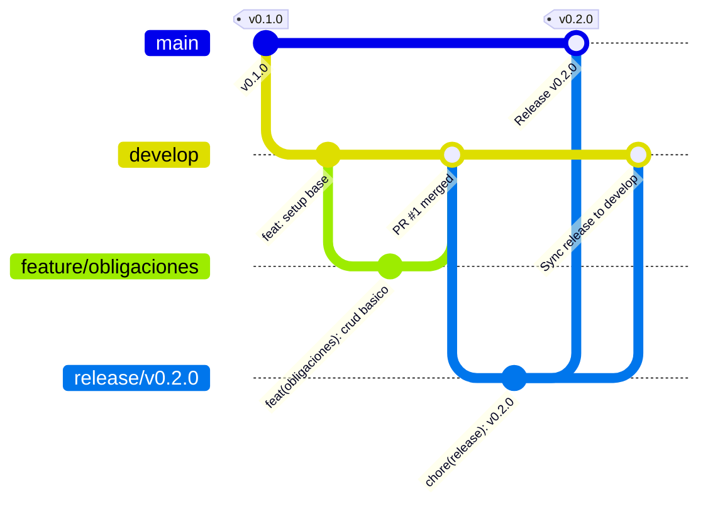

# Guía de Contribución y Control de Versiones (GitFlow)

Este documento establece las **reglas obligatorias** y los estándares para la gestión del repositorio, ramas, commits y releases en el proyecto **Tu-chauchera-web**.

---

## 1. Modelo de Ramas (GitFlow)

El repositorio opera bajo una adaptación estandarizada de **GitFlow**:



### 1.1. Ramas Principales (Infraestructura)
* **`main` (o `master`)**:
  * Representa el código en **producción**, 100% estable y desplegable.
  * **Prohibido hacer commits directos.**
  * Solo recibe cambios mediante Pull Requests desde ramas `release/*` o `hotfix/*`.
  * Cada merge a `main` debe ir acompañado de un tag de versión semántica (ej. `v1.0.0`).
* **`develop`**:
  * Rama de **integración continua** para el desarrollo activo.
  * Contiene las últimas características terminadas que formarán parte de la próxima versión.
  * Base desde donde nacen las ramas `feature/*` y `release/*`.

---

## 2. Ramas de Soporte y Nomenclatura

| Tipo de Rama | Rama Origen | Rama Destino | Convención de Nombre | Ejemplo |
| :--- | :--- | :--- | :--- | :--- |
| **Feature** | `develop` | `develop` | `feature/<modulo-o-funcionalidad>` | `feature/obligaciones-financieras` |
| **Bugfix** | `develop` | `develop` | `bugfix/<descripcion-corta>` | `bugfix/calculo-interes-cuotas` |
| **Release** | `develop` | `main` y `develop` | `release/v<version>` | `release/v0.2.0` |
| **Hotfix** | `main` | `main` y `develop` | `hotfix/<descripcion-corta>` | `hotfix/env-supabase-timeout` |

---

## 3. Estándar de Mensajes de Commit (Conventional Commits)

Todos los commits deben seguir el formato [Conventional Commits v1.0.0](https://www.conventionalcommits.org/):

```text
<tipo>(<alcance>): <descripción corta en modo imperativo>

[Cuerpo opcional con detalles y justificación del cambio]

[Pie opcional: Closes #123, Breaking Changes, etc.]
```

### Tipos Permitidos
* `feat`: Nueva funcionalidad para el usuario.
* `fix`: Corrección de un error/bug.
* `refactor`: Refactorización de código sin alterar la lógica funcional ni corregir bugs.
* `docs`: Cambios en documentación (`README.md`, `CONTRIBUTING.md`, etc.).
* `style`: Formateo de código, estilos CSS puros, espacios en blanco (sin cambio de lógica).
* `test`: Adición o modificación de pruebas unitarias/integración.
* `chore`: Mantenimiento, dependencias, configuraciones de compilación (`package.json`, `vite.config.ts`, `eslint.config.js`).
* `perf`: Mejoras de rendimiento.

### Ejemplos Válidos
* `feat(obligaciones): agregar soporte para cuotas fijas y variables`
* `fix(dashboard): corregir calculo de saldo remanente mensual`
* `docs(git): agregar reglas de contribucion y gitflow`
* `chore(deps): actualizar supabase-js a v2.x`

---

## 4. Flujo de Trabajo para Nuevas Funcionalidades

1. **Actualizar `develop`:**
   ```bash
   git checkout develop
   git pull origin develop
   ```
2. **Crear la rama de trabajo:**
   ```bash
   git checkout -b feature/nombre-de-la-funcionalidad
   ```
3. **Desarrollo y Commits Atómicos:**
   * Realizar commits pequeños y con propósito único.
   * Ejecutar validaciones locales antes de enviar:
     ```bash
     npm run lint
     npm run build
     ```
4. **Abrir Pull Request (PR):**
   * Crear el PR con base en **`develop`**.
   * Incluir descripción clara de lo realizado y pruebas hechas.

---

## 5. Proceso de Release

1. Crear la rama de release desde `develop`:
   ```bash
   git checkout develop
   git checkout -b release/v0.2.0
   ```
2. Realizar ajustes de versión en `package.json` y changelog:
   ```bash
   git commit -m "chore(release): bump version to 0.2.0"
   ```
3. Integrar a `main` con Tag:
   ```bash
   git checkout main
   git merge release/v0.2.0
   git tag -a v0.2.0 -m "Release version 0.2.0"
   ```
4. Sincronizar hacia `develop`:
   ```bash
   git checkout develop
   git merge release/v0.2.0
   git branch -d release/v0.2.0
   ```

---

## 6. Ciclo de Vida de Versiones y SemVer (Alpha, Beta, RC, Stable)

El proyecto utiliza **Versionado Semántico (SemVer: `MAJOR.MINOR.PATCH`)** combinado con tags de pre-lanzamiento según el estado de madurez:

```mermaid
gitGraph
   branch develop
   checkout develop
   commit id: "feat: core modules" tag: "v0.1.0-alpha"
   branch release/v1.0.0
   checkout release/v1.0.0
   commit id: "chore: beta 1" tag: "v1.0.0-beta.1"
   commit id: "fix: bug fix testers" tag: "v1.0.0-beta.2"
   commit id: "chore: pre-release" tag: "v1.0.0-rc.1"
   checkout main
   merge release/v1.0.0 id: "Merge Prod" tag: "v1.0.0 (Stable)"
   checkout develop
   merge release/v1.0.0 id: "Sync back"
```

| Fase | Rama GitFlow Asociada | Formato de Tag | Criterio de Entrada y Salida |
| :--- | :--- | :--- | :--- |
| **Alpha** | `develop` y `feature/*` | `v0.X.Y-alpha.N` | **Desarrollo activo:** Módulos en construcción, schemas volátiles, sin todas las funciones completadas. |
| **Beta** | `release/vX.Y.Z` | `vX.Y.Z-beta.N` | **Feature Complete:** Se congelan nuevas features en la rama release. Se despliega a entorno Staging/Beta exclusivamente para QA, corrección de bugs (`fix: ...`) y pruebas de usuarios. |
| **Release Candidate (RC)** | `release/vX.Y.Z` | `vX.Y.Z-rc.N` | **Candidato a Producción:** Sin bugs conocidos. Pruebas finales de regresión y build de producción. |
| **Stable (Producción)** | `main` | `vX.Y.Z` (ej. `v1.0.0`) | **Producción:** Fusión de la rama release en `main` acompañada del tag oficial. |

---

## 7. Manejo de Secretos y Archivos Sensibles

* **Nunca commitear `.env` o archivos con credenciales reales.**
* Mantener siempre actualizado `.env.example` con las variables ficticias/plantilla necesarias para levantar el proyecto.
