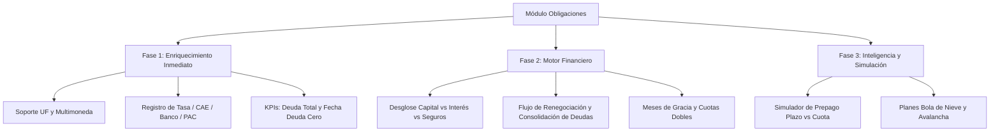

# 💳 Funcionalidades Adicionales para el Módulo de Obligaciones Financieras

Actualmente, el módulo de **Obligaciones** en **Tu Chauchera Web** gestiona:
- Creación de obligaciones con cuotas generadas por adelantado (*eager generation*).
- Monto total, número de cuota inicial, cuota periódica y día de vencimiento.
- Categorías y subcategorías.
- Estados (`PENDING`, `PAID`, `RENEGOTIATED`, `DELETED`).

A continuación se detalla una propuesta completa de **funcionalidades adicionales de alto impacto** específicas para este módulo, agrupadas por temática y valor para el usuario.

---

## 1. 🧮 Tipos de Créditos y Modelos de Amortización

Actualmente las obligaciones asumen cuotas fijas uniformes. Se pueden agregar tipos de crédito reales del sistema financiero:

* **Tablas de Amortización Dinámicas**:
  - **Sistema Francés**: Cuota fija con desglose decreciente de intereses y creciente de amortización a capital.
  - **Sistema Alemán**: Amortización de capital fija con cuotas decrecientes en el tiempo.
  - **Créditos Rotativos / Líneas de Crédito**: Pago de interés mensual con amortización libre o pago mínimo.
* **Desglose de la Cuota**:
  - Distinguir dentro de cada cuota: **Capital**, **Interés**, **Seguros obligatorios** (desgravamen, cesantía, sismo/incendio) y **Gastos operacionales**.
  - Permite saber exactamente cuánto dinero se va a costo financiero (pérdida) y cuánto a reducir deuda real.

---

## 2. 💱 Soporte Multimoneda y Reajustabilidad (UF / USD / UTM)

Especialmente relevante para el mercado chileno y latinoamericano:

* **Obligaciones en UF (Unidad de Fomento)**:
  - Créditos hipotecarios, arriendos y planes de salud suelen estar pactados en UF.
  - Guardar el monto base en UF (ej. `14.5 UF/mes`) y calcular el equivalente en CLP al momento de proyectar o pagar con el valor UF del día o del mes.
* **Créditos en Moneda Extranjera (USD / EUR)**:
  - Registro en divisa original con conversión automática o manual al tipo de cambio observado.

---

## 3. 🎯 Simulador de Prepago y Estrategias de Liquidación de Deudas

Herramientas para ayudar activamente al usuario a salir de deudas más rápido:

* **Simulador de Abono Extraordinario / Prepago**:
  - Simular qué ocurre si se pagan $500.000 extra hoy:
    - *Opción A: Reducir plazo* (eliminar las últimas N cuotas y ahorrar intereses).
    - *Opción B: Reducir monto de cuota* (recalcular cuota mensual más baja para dar holgura de liquidez).
* **Estrategias Automáticas de Desendeudamiento**:
  - **Método Bola de Nieve (Snowball)**: Pagar mínimos en todo y liquidar primero la obligación con menor saldo total (victoria psicológica rápida).
  - **Método Avalancha (Avalanche)**: Pagar mínimos en todo y atacar primero la deuda con la tasa de interés más alta (ahorro matemático óptimo de intereses).

---

## 4. 🔄 Renegociación, Consolidación y Refinanciamiento

El modelo ya contempla el estado `RENEGOTIATED` (`renegotiatedFromId`), pero puede expandirse en UI/UX:

* **Asistente de Refinanciamiento**:
  - Tomar una obligación activa (ej. 18 cuotas pendientes de 36) y generar una nueva obligación vinculada con nuevas condiciones (tasa más baja o más plazo), marcando la anterior como refinanciada y conservando la trazabilidad histórica.
* **Consolidación de Deudas (Compra de Cartera)**:
  - Seleccionar múltiples obligaciones activas (ej. 2 tarjetas de crédito + 1 crédito de consumo) y fusionarlas en una única nueva obligación (Crédito de Consolidación), cerrando las anteriores en un solo clic.

---

## 5. 🏷️ Atributos Financieros Adicionales

Campos enriquecidos para tener control total de la deuda:

* **Tasa de Interés y CAE**:
  - Tasa de Interés Mensual / Anual (TNA / TEA).
  - **CAE (Carga Anual Equivalente)** y **CTC (Costo Total del Crédito)** para comparar qué crédito es realmente más caro.
* **Entidad / Institución Acreedora**:
  - Selector de bancos o casas comerciales (Banco Santander, BCI, BancoEstado, CMR, Cencosud, Ripley, etc.).
* **Medio de Pago Asociado**:
  - Vincular si la obligación se paga mediante **PAC / PAT** (pago automático en cuenta o tarjeta), transferencia manual o caja vecina.
* **Comprobantes y Documentos Adjuntos (Metadata/Drive Links)**:
  - Guardar el ID de archivo en Google Drive del pagaré, contrato o comprobante de pago de la cuota.

---

## 6. 📅 Flexibilidad en el Calendario de Cuotas

* **Meses de Gracia / Cuotas Flexibles**:
  - Configurar meses sin pago (ej. gracia en marzo o cuota comodín) sin alterar la correlación de cuotas.
* **Cuotas Extraordinarias (Cuotones o Balón)**:
  - Configuración de cuotas con monto diferencial pactado (ej. cuota 12 y 24 con monto doble o cuota final de compra inteligente automotriz).

---

## 7. 📊 Métricas e Indicadores Clave del Módulo

Tarjetas de resumen (*KPIs*) en la cabecera de la vista de Obligaciones:

| Indicador | Descripción |
| :--- | :--- |
| **Pasivo Total (Deuda Viva)** | Suma de todo el capital restante por pagar de todas las obligaciones activas. |
| **Carga Financiera Mensual** | Suma de cuotas a pagar en el mes en curso vs ingreso total. |
| **Fecha Estimada de Deuda Cero** | Mes y año exacto en que se pagará la última cuota si no se adquieren nuevas deudas. |
| **Intereses Restantes por Pagar** | Estimación de cuánto dinero se pagará en intereses futuros. |

---

## 🚀 Hoja de Ruta de Implementación Sugerida

