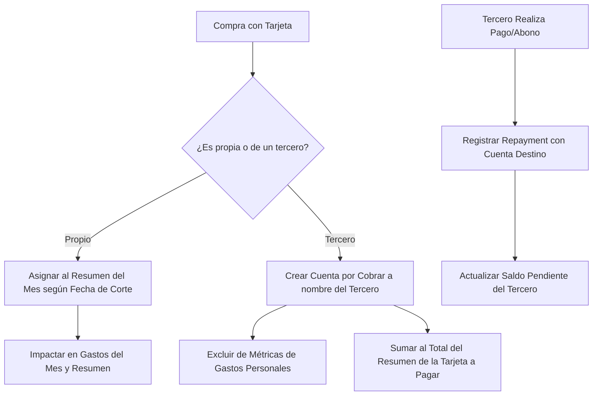

# Architecture & Design: credit-cards-and-third-party-debts

## 1. Architecture Overview

El módulo se compone de 3 capas principales:
1. **Dominio y Tipos (`src/shared/types/domain.ts`):** Entidades `CreditCardAccount`, `CreditCardPlastic`, `CreditCardPurchase`, `ThirdPartyReceivable`.
2. **Estado y Lógica de Negocio (Zustand & Utility Services):**
   - `src/features/credit-cards/store/creditCardSlice.ts`
   - `src/features/credit-cards/utils/cycleCalculators.ts` (cálculo de cierre vs fecha de compra)
   - `src/features/credit-cards/hooks/useCreditCardSummary.ts`
3. **Componentes UI (React + Tailwind CSS):**
   - `CreditCardsDashboard`: Vista general de tarjetas, resúmenes actuales y cupos disponibles.
   - `CreditCardAccountModal`: Creación/edición de cuenta de crédito con soporte para agregar plásticos adicionales dinámicamente.
   - `CreditCardPurchaseModal`: Registro de compras con selector de plástico emisor, número de cuotas y toggle "Gasto Propio" vs "Compra para un Tercero".
   - `ThirdPartyReceivablesView`: Tablero de control de compras prestadas, montos adeudados por contacto y registro de pagos parciales/totales.

## 2. Flujo de Datos

## 3. Estrategia de Migración y Compatibilidad
- Nuevos campos opcionales o tienda `creditCardsStore` en el archivo cifrado.
- Si no hay tarjetas configuradas, la app funciona exactamente como hasta hoy sin cambios forzados.
